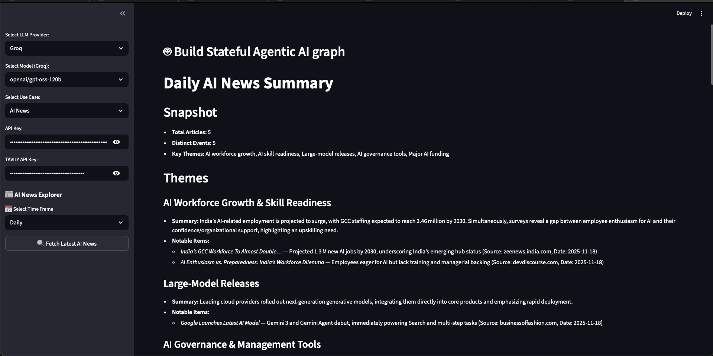
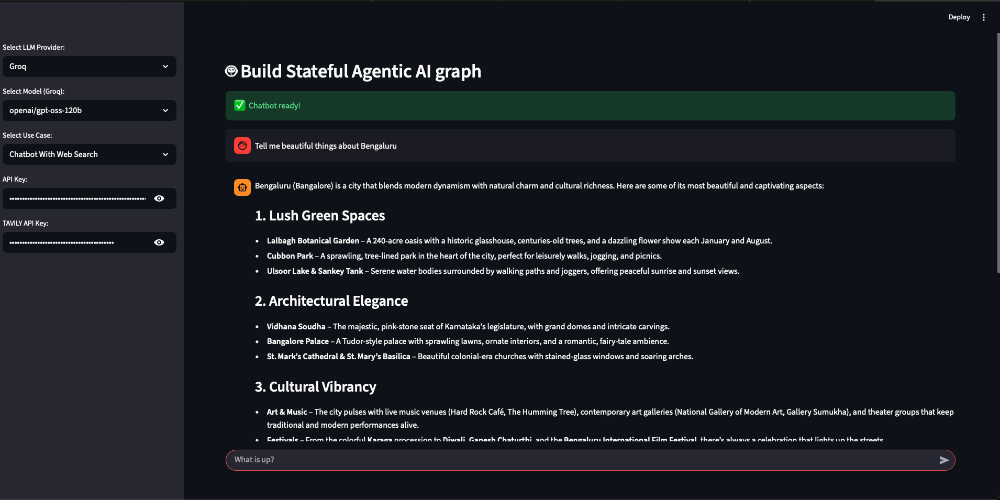

# 🤖 AINewsBot

A sophisticated AI-powered chatbot application with integrated AI news summarization capabilities, built using modern Python frameworks including LangChain, LangGraph, and Streamlit.

[](LICENSE)
[](https://python.org)
[](https://streamlit.io)

## 📋 Table of Contents
- [🌟 Preview](#-preview)
- [✨ Features](#-features)
- [🚀 Quick Start](#-quick-start)
- [📖 Usage](#-usage)
- [🏗️ Architecture](#️-architecture)
- [🔧 Configuration](#-configuration)
- [📁 Project Structure](#-project-structure)
- [📞 Support](#-support)

## 🌟 Preview

<div align="center">

### Interactive Chat Interface


### AI News Summarization Dashboard


</div>

## ✨ Features

### 🗣️ **Interactive Chatbot**
- Multi-provider LLM support (GROQ, OpenAI, and more)
- Tool integration with web search capabilities
- Conversation memory and context preservation
- Professional system prompts for high-quality responses

### 📰 **AI News Summarization**
- Automated news fetching from Tavily Search API
- AI-powered summarization with structured markdown output
- Configurable time frames (Daily, Weekly, Monthly)
- Automatic file saving to organized directory structure

### 🏗️ **Advanced Architecture**
- **LangGraph**: State-based workflow orchestration
- **LangChain**: Modern LLM integration and tool binding
- **Pydantic**: Type-safe data validation and configuration
- **Streamlit**: Clean, interactive web interface

## 📸 Application Screenshots

### Chat Interface


### AI News Summarization


## 🚀 Quick Start

### Prerequisites

- Python 3.12+
- Conda (recommended) or pip
- API Keys:
  - GROQ API key (or OpenAI/other LLM provider)
  - Tavily API key (for news search)

### Installation

1. **Clone the repository:**
```bash
git clone https://github.com/pavm035/AINewsBot.git
cd AINewsBot
```

2. **Create and activate conda environment:**
```bash
conda env create -f environment.yml
conda activate LangGraphBasicChatBot
```

   ⚠️ **Important**: Make sure to activate the environment before running the app!

**Alternative: Using pip:**
```bash
# Create virtual environment
python -m venv venv
source venv/bin/activate  # On Windows: venv\Scripts\activate

# Install dependencies
pip install -r requirements.txt
```

3. **Set up environment variables:**
Copy the example environment file and add your API keys:
```bash
cp .env.example .env
```

Then edit `.env` with your actual API keys:
```env
GROQ_API_KEY=your_groq_api_key_here
TAVILY_API_KEY=your_tavily_api_key_here
# Add other provider keys as needed
OPENAI_API_KEY=your_openai_key_here
```

4. **Run the application:**
```bash
streamlit run app/main.py
```

5. **Access the application:**
Open your browser to `http://localhost:8501`

### 🔧 Verify Installation

To verify your installation works correctly:

```bash
# Test by running the Streamlit app
streamlit run app/main.py

# The app should start without import errors
# You'll see: "You can now view your Streamlit app in your browser."
```

If you see the Streamlit interface load without errors, your installation is successful!

### 🔑 Required API Keys

Before using the application, you'll need:

1. **GROQ API Key** (Primary LLM provider)
   - Sign up at [GROQ Console](https://console.groq.com/)
   - Free tier available

2. **Tavily API Key** (For news search and web search)
   - Sign up at [Tavily](https://tavily.com/)
   - Free tier available

3. **OpenAI API Key** (Optional alternative LLM provider)
   - Sign up at [OpenAI Platform](https://platform.openai.com/)
   - Requires paid plan for API access

## 📖 Usage

### Chatbot Mode
1. Select your preferred LLM provider and model
2. Enter your API keys in the sidebar
3. Choose "Basic Chatbot" use case
4. Start chatting! The bot can search the web for current information

### AI News Mode
1. Configure your LLM provider and API keys
2. Select "AI News" use case
3. Choose time frame (Daily/Weekly/Monthly)
4. The system will automatically:
   - Fetch latest AI news
   - Generate comprehensive summary
   - Save results to `./AI_News/` directory

## 🏗️ Architecture

### Core Components

```
app/
├── main.py                 # Application entry point
├── newsbot/
│   ├── app.py             # Main application class
│   ├── core/              # Core configuration and utilities
│   │   ├── config/        # Configuration management
│   │   └── logger.py      # Logging setup
│   ├── features/          # Feature implementations
│   │   ├── common/        # Shared base classes
│   │   ├── chat/          # Chatbot functionality
│   │   └── ai_news/       # AI news processing
│   └── ui/                # Streamlit UI components
```

### Key Design Patterns

- **Abstract Base Classes**: Clean contracts for agents and LLMs
- **Singleton Pattern**: Thread-safe configuration management
- **State Machine**: LangGraph workflows with TypedDict state
- **Factory Pattern**: Dynamic LLM provider instantiation

## 🔧 Configuration

### LLM Providers
Supported providers configured in `app/newsbot/core/config/uiconfig.yml`:
- GROQ (default)
- OpenAI
- Easily extensible for additional providers

### Models
Each provider supports multiple models:
- GROQ: Various open-source models
- OpenAI: GPT-4, GPT-3.5-turbo variants

## 📁 Project Structure

### Chat Feature
- **Agent**: `chat_bot_agent.py` - Main orchestrator
- **LLM**: `chat_bot_llm.py` - LLM wrapper with tool support
- **Graph**: `chat_bot_graph_builder.py` - LangGraph workflow
- **Node**: `chat_bot.py` - Core conversation processing
- **State**: `chat_state.py` - TypedDict state management
- **Tools**: `search_tool.py` - Web search integration

### AI News Feature
- **Agent**: `ai_news_agent.py` - News processing orchestrator
- **Graph**: `ai_news_graph_builder.py` - Linear pipeline workflow
- **Nodes**: 
  - `fetch_news.py` - News article retrieval
  - `summarize.py` - AI-powered summarization
  - `save_result.py` - File output management

## 🛠️ Development

### Code Quality
- **Type Safety**: Comprehensive type hints throughout
- **Error Handling**: Graceful degradation and proper exception handling
- **Logging**: Structured logging with appropriate levels
- **Documentation**: Comprehensive docstrings and comments

### Testing
```bash
# Install test dependencies (if added)
pip install pytest pytest-cov

# Run tests
pytest tests/
```

### Code Style
```bash
# Format code
black app/
isort app/

# Type checking
mypy app/
```

## 🔌 API Keys Setup

### GROQ API
1. Visit [GROQ Console](https://console.groq.com/)
2. Create an account and generate API key
3. Add to `.env` file

### Tavily Search API
1. Visit [Tavily](https://tavily.com/)
2. Sign up and get API key
3. Add to `.env` file

### OpenAI API (Optional)
1. Visit [OpenAI Platform](https://platform.openai.com/)
2. Generate API key
3. Add to `.env` file

## 📊 Features Deep Dive

### LangGraph Workflows

**Chat Workflow:**
```
Start → ChatBot → [Tools?] → Tools → ChatBot → End
                     ↓
                    End
```

**AI News Workflow:**
```
Start → Fetch News → Summarize → Save Result → End
```

### State Management
- **ChatState**: Conversation history with message accumulation
- **AINewsState**: Pipeline state for news processing workflow

### Tool Integration
- Web search via Tavily API
- Automatic tool binding for enhanced responses
- Conditional tool usage based on query context

## 🚀 Deployment

### Local Development
```bash
streamlit run app/main.py --server.port 8501
```

### Docker (Future Enhancement)
```dockerfile
# Example Dockerfile structure
FROM python:3.12-slim
WORKDIR /app
COPY requirements.txt .
RUN pip install -r requirements.txt
COPY app/ ./app/
CMD ["streamlit", "run", "app/main.py"]
```

## 🤝 Contributing

We welcome contributions! Please see our [Contributing Guide](CONTRIBUTING.md) for details.

1. Fork the repository
2. Create a feature branch: `git checkout -b feature/amazing-feature`
3. Commit your changes: `git commit -m 'Add amazing feature'`
4. Push to the branch: `git push origin feature/amazing-feature`
5. Open a Pull Request

Please read [CONTRIBUTING.md](CONTRIBUTING.md) for details on our code of conduct and development process.

## 📝 License

This project is licensed under the MIT License - see the [LICENSE](LICENSE) file for details.

## 🙏 Acknowledgments

- **LangChain**: For the excellent LLM integration framework
- **LangGraph**: For state-based workflow orchestration
- **Streamlit**: For the intuitive web interface framework
- **Tavily**: For reliable news search API
- **GROQ**: For fast inference capabilities

## 📞 Support

If you encounter any issues or have questions:
1. Check the [Issues](https://github.com/pavm035/AINewsBot/issues) section
2. Review the configuration in `uiconfig.yml`
3. Verify API keys are properly set in `.env`
4. Check logs for detailed error information

For more detailed setup help, see [CONTRIBUTING.md](CONTRIBUTING.md).

## 🔧 Troubleshooting

### Common Issues

1. **Import Errors**
   ```bash
   # Make sure you're in the project directory
   cd AINewsBot
   
   # Ensure Python can find the app module
   export PYTHONPATH="${PYTHONPATH}:$(pwd)"
   ```

2. **Missing API Keys**
   - Verify your `.env` file exists and contains valid API keys
   - Check that there are no extra spaces around the `=` signs
   - Ensure API keys are active and have proper permissions

3. **Streamlit Port Issues**
   ```bash
   # If port 8501 is busy, specify a different port
   streamlit run app/main.py --server.port 8502
   ```

4. **Conda Environment Issues**
   ```bash
   # If environment creation fails, update conda first
   conda update conda
   
   # Or use pip installation as alternative
   pip install -r requirements.txt
   ```

## 🔮 Future Enhancements

- [ ] RAG (Retrieval-Augmented Generation) integration
- [ ] Multi-agent conversation workflows
- [ ] Database integration for conversation persistence
- [ ] REST API endpoints
- [ ] Enhanced UI with conversation export
- [ ] Custom tool development framework
- [ ] Multi-language support
- [ ] Advanced analytics and metrics

---

**Happy Coding!** 🎉

Built with ❤️ using modern Python and AI frameworks.
